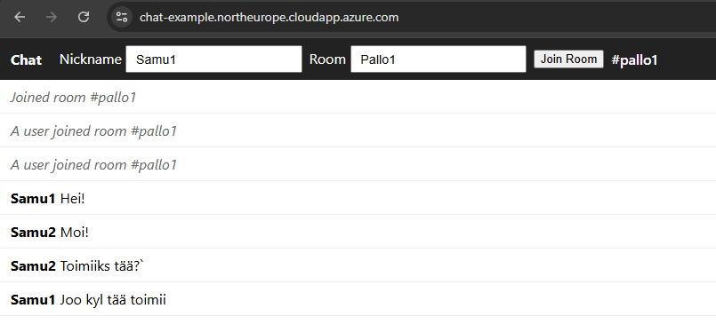
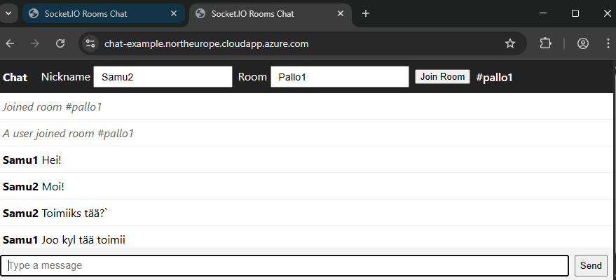

# Socket.IO Chat (Rooms + Usernames)

Repository: https://github.com/samukan/socket-chat-example

## 1. Overview

A lightweight real‑time chat application built with Node.js, Express, and Socket.IO. Supports multiple rooms, per‑message usernames, and basic system messages on room join/leave events. Designed to demonstrate WebSocket (Socket.IO) usage, input sanitization, and a simple production deployment on an Ubuntu 22.04 Azure VM fronted by Apache (reverse proxy) with Let’s Encrypt TLS.

## 2. Features

- Real‑time bi‑directional messaging via Socket.IO
- Dynamic room join/leave (default room: `general`)
- Per‑message username (falls back to `Anonymous`)
- System notifications on room changes
- Client‑side filtering to only display messages for the active room
- Static assets served by Express (`/public`)

## 3. Screenshots

| Chat UI (rooms)                         | Multiple tabs demo                      |
| --------------------------------------- | --------------------------------------- |
|  |  |

> The first image shows the main interface with room selection; the second shows concurrent sessions demonstrating real‑time updates.

## 4. Tech Stack

- Runtime: Node.js (LTS)
- Server: Express + Socket.IO
- Reverse Proxy (prod): Apache HTTPD (modules: proxy, proxy_http, proxy_wstunnel, headers, ssl)
- TLS: Let’s Encrypt (Certbot)

Apache handles HTTP→HTTPS redirect and WebSocket upgrade (via `proxy_wstunnel`). The Node process is managed by `systemd` for autorestart.

## 5. Local Development

```bash
npm install
npm start
# App runs on http://localhost:3000
```

Open multiple browser tabs to simulate different users. Change room name and nickname to test behavior.

## 6. Input Sanitization (Server)

| Item     | Limits / Rules                                   |
| -------- | ------------------------------------------------ |
| Room     | Lowercased, alphanumeric + `_` `-`, max 30 chars |
| Username | Trimmed, max 30 chars, fallback `Anonymous`      |
| Message  | Trimmed, max 500 chars                           |
